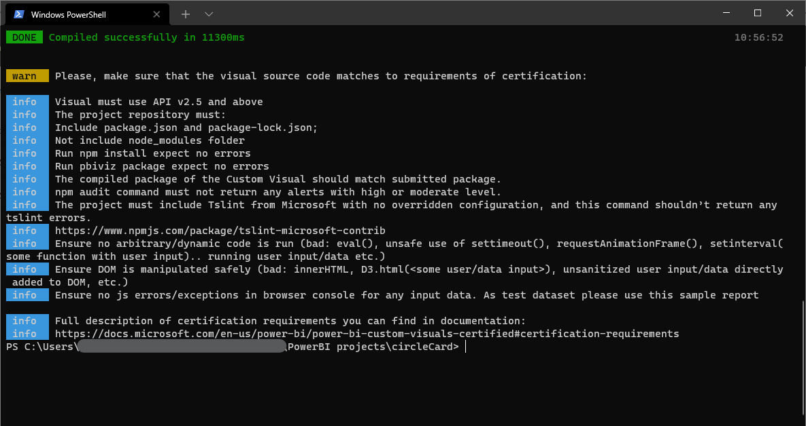

> # Power BI CircleCard tutorial
>
> This repository is maint for testing purpose and first look I had on Power BI Desktop with custom development.

## Built for and with

* [Visual Studio Code](https://code.visualstudio.com/) - A great free, open source IDE meant to run everywhere

### Compiled via Terminal

* `npm install` audited 148 packages with 0 found vulnerabilities,
* `pbiviz package` compiled successfully the custom visual,
* `npm audit` returned 0 vulnerabilities.

